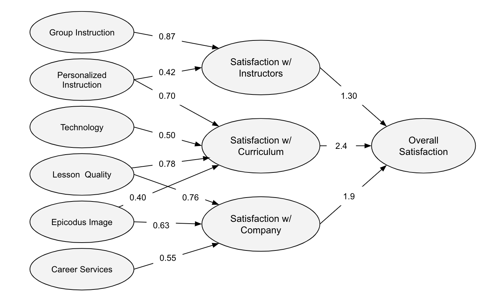
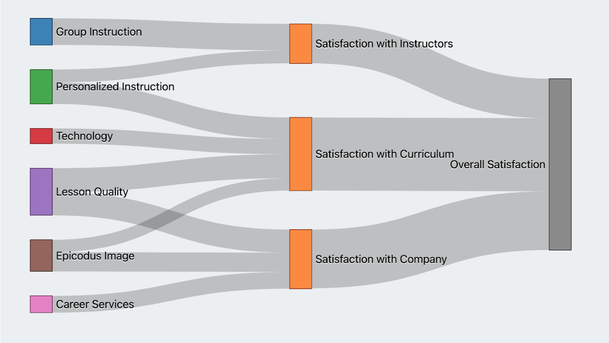

##  Epicodus Capstone Project: Explore D3.js
------------------------------


## 🌐 About the Project

### 📖 Description
My main goal was to explore the [D3.js](https://d3js.org/) data visualization library. Deliverable wise, my goal was to make an interactive site using D3 React, and Firebase, where a user could input data and have it displayed in a series of graphs. 

Upon further exploration, I learned that D3 and React both want to control the DOM, and can conflict with each other. There are many ways to work around these conflicts, many of them explained by Marcos Iglesias in [Bringing Together React, D3, And Their Ecosystem.](https://www.smashingmagazine.com/2018/02/react-d3-ecosystem/) Adam Janes, who teaches the [Introduction to D3.js with React](https://www.udemy.com/course/d3-react/) course on Udemy opted to go with the Lifecycle Methods Wrapping method, which makes use of the lifecycle methods present in class-based React components. I followed that rabbit for a few hours, but due to time constraints, and figuring out that probably wasn't the most up-to-date method, I tabled it for now.

To have something to show at the end of the week, I took what I had lerned in the tutorials, and applied it to create a Sankey chart using D3 and just basic HTML. Sankey charts are something I've used in previous jobs to display Structural equation modeling (SEM) model pututs in more user-comprehensable fashion. 

Here's a pretty typical structural equation model output, depicting a fictional survey of Epicodus students on what inputs most impacts overall satisfaction with the program. The numbers associated with the arrows show how much each input impacts the items upstream, which finally impacts Overall Satisfaction. 


Here's the same data, visualized with a Sankey Diagram. Though it could be improved, I think having each link relatively sized according to its associated value has a huge impact on the readability of the model. It's much easier to visually see where the larger impacts are, rather than trying to read, and remember each value, as you have to do in the first example. 



### 🛠 Built With
* [D3.js](https://d3js.org/)
* [React.js](https://reactjs.org/)
* [Visual Studio Code](https://code.visualstudio.com/)

### 📚 Tutorials used
* [Build Data Visualizations with D3.js & Firebase](https://www.udemy.com/course/build-data-uis-with-d3-firebase/) (Udemy)
* [Introduction to D3.js with React](https://www.udemy.com/course/d3-react/) (Udemy)


------------------------------

## 🏁 Getting Started

### ⚙️ Setup and Use

  #### Cloning

  1) Navigate to the [capstone repository here](https://github.com/derrak/capstone).
  2) Click 'Clone or download' to reveal the HTTPS url ending with .git and the 'Download ZIP' option.
  3) Open up your system Terminal or GitBash, navigate to your desktop with the command: `cd Desktop`, or whichever location suits you best.
  4) Clone the repository to your desktop: `$ git clone https://github.com/derrak/capstone`
  5) Run the command `cd capstone` to enter into the project directory.
  6) View or Edit:
      * Code Editor - Run the command `atom .` or `code .` to open the project in Atom or VisualStudio Code respectively for review and editing.
      * Text Editor - Open by double clicking on any of the files to open in a text editor.
  7) Within your editor, you should be able to right-click and then select "Open with Live Server" on any of the index.html files within a directory to see the results in your browser.

### 🦠 Known Bugs

* None


### ⚖️ License

This project is licensed under the [MIT License](https://opensource.org/licenses/MIT). Copyright (C) 2022 Derrak Richard. All Rights Reserved.

```
MIT License

Copyright (c) 2022 Derrak Richard.

Permission is hereby granted, free of charge, to any person obtaining a copy
of this software and associated documentation files (the "Software"), to deal
in the Software without restriction, including without limitation the rights
to use, copy, modify, merge, publish, distribute, sublicense, and/or sell
copies of the Software, and to permit persons to whom the Software is
furnished to do so, subject to the following conditions:

The above copyright notice and this permission notice shall be included in all
copies or substantial portions of the Software.

THE SOFTWARE IS PROVIDED "AS IS", WITHOUT WARRANTY OF ANY KIND, EXPRESS OR
IMPLIED, INCLUDING BUT NOT LIMITED TO THE WARRANTIES OF MERCHANTABILITY,
FITNESS FOR A PARTICULAR PURPOSE AND NONINFRINGEMENT. IN NO EVENT SHALL THE
AUTHORS OR COPYRIGHT HOLDERS BE LIABLE FOR ANY CLAIM, DAMAGES OR OTHER
LIABILITY, WHETHER IN AN ACTION OF CONTRACT, TORT OR OTHERWISE, ARISING FROM,
OUT OF OR IN CONNECTION WITH THE SOFTWARE OR THE USE OR OTHER DEALINGS IN THE
SOFTWARE.
```

------------------------------

<center><a href="#">Return to Top</a></center>